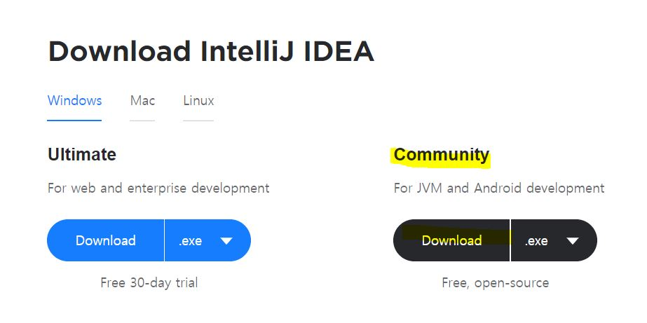
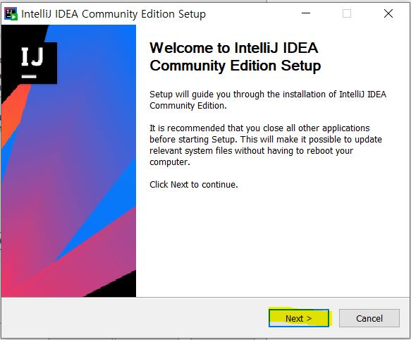
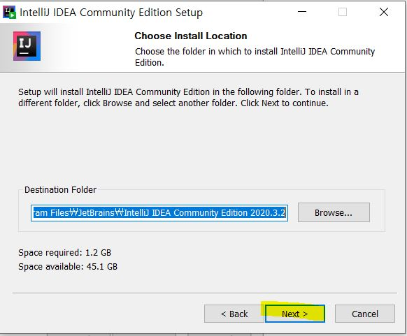
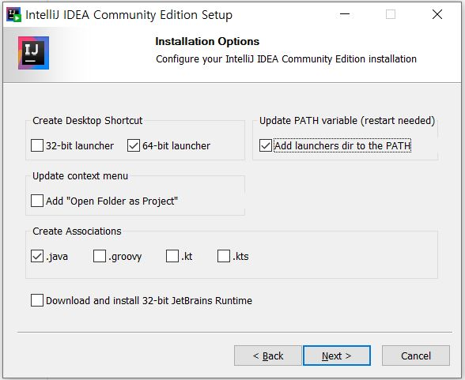
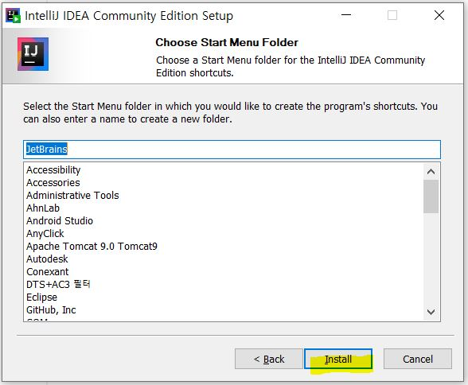
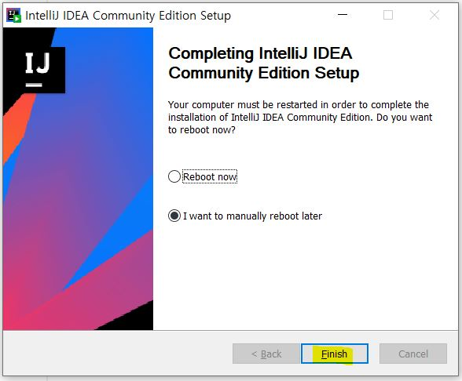
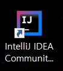
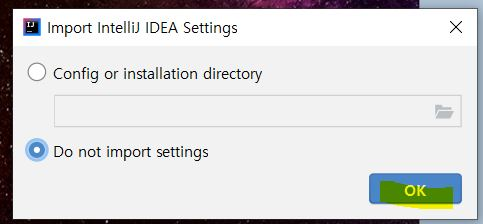
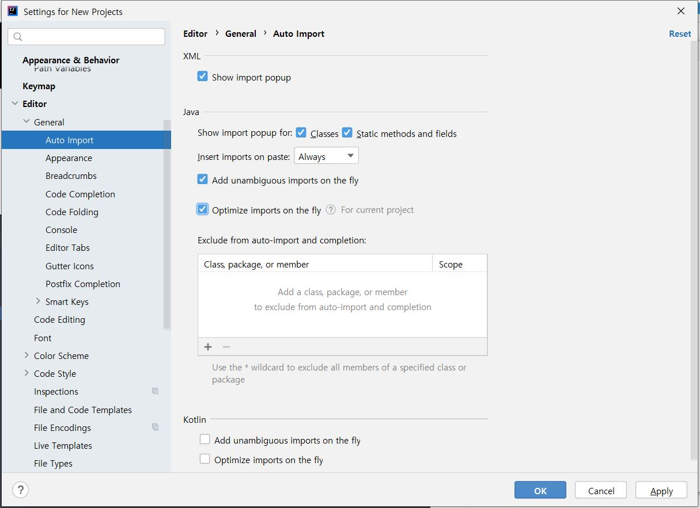
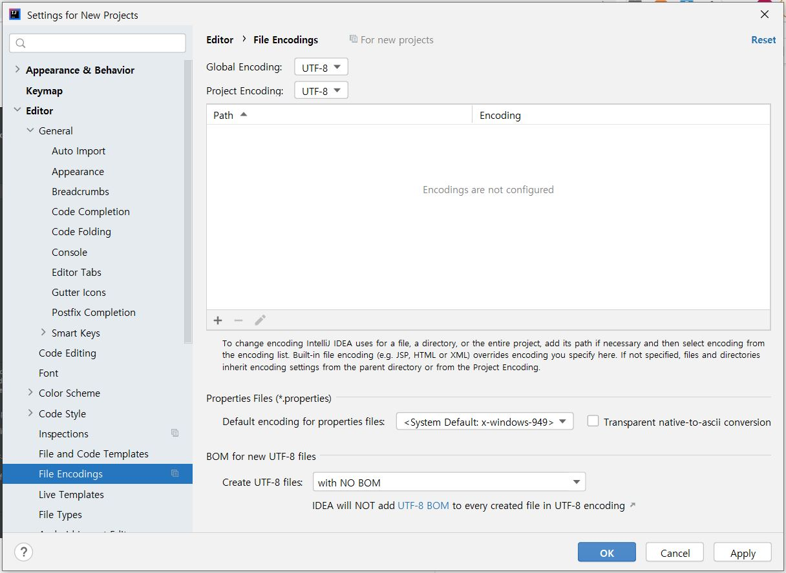

# Learn-Spring

### ✔ Spring , Spring Boot 복습하기 !

 
 

🌠 [인프런 - 스프링 입문](https://www.inflearn.com/course/%EC%8A%A4%ED%94%84%EB%A7%81-%EC%9E%85%EB%AC%B8-%EC%8A%A4%ED%94%84%EB%A7%81%EB%B6%80%ED%8A%B8#) 강의를 듣고
 
🌠 강의 내용 정리는 [🙌여기](https://github.com/o3o-ovo3/Learn-Spring/tree/main/Summary)
 
🌠 실습 프로젝트 레포지토리는 [🙌여기](https://github.com/o3o-ovo3/hello-spring)
 
 
✨ 실습을 할 때에는 intelliJ를 사용 👇
 

#### 처음 접해본 intelliJ ! 설치하기💫

1. [인텔리제이(intelliJ)](https://www.jetbrains.com/idea/download/#section=windows) Download 페이지에서 Community 버전으로 다운로드

 

 

2. Next

 

 

3. 경로 설정 후 Next

 

 

4. 환경 설정 후 Next

 

 

5. Next

 

 

6. Finish

 

 

7. 실행을 위해 아이콘 클릭

 

 

8. 이전에 설치한 내용이 없다면 2번째에 체크하고 OK

 

 

9. Settings 에서 Auto Import 설정

 

 

10. Settings 에서 Encoding 을 UTF08로 변경

 

 

11. 끝 💯
