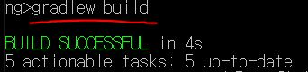
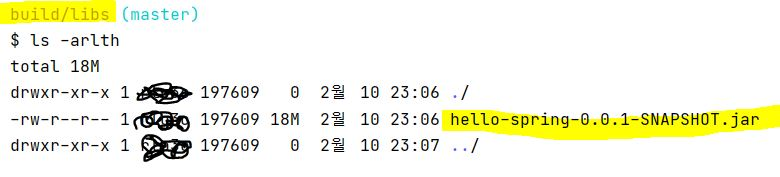

# 인프런 - 스프링 입문 강의 내용 정리

### 4. 빌드하고 실행하기

- 빌드 방법 (Windows)

  - 프로젝트가 있는 곳으로 디렉토리 위치 변경 
    - cd Study/hello-spring

   

  - gradle.bat을 실행하여 프로젝트 빌드
    - gradlew build

  

 

 

- 빌드한 실행 파일을 실행하기

  - 빌드하면 build 폴더가 생긴다.

    - libs 폴더에 들어가면 jar 파일이 존재한다. (실행 파일)

    

   

  - 실행 파일을 실행 시켜주면 끝 !

    - java -jar hello-spring-0.0.1-SNAPSHOT.jar

     

     

  - 서버 배포할 때 이 jar 파일만 가지고 배포하면 되는 것이다.

 

 

- 생소한 명령어들 정리
  - ls <mark>-arlth</mark> : -arlth 는 모든 파일, 폴더를 시간 역순으로 출력하는 명령어이다.
  - clean build : build 한 것을 지워준다. 실행이 잘 안돼서 다시 빌드하고 싶을 때 유용하다.
