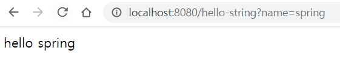

# 인프런 - 스프링 입문 강의 내용 정리

### 7. API

- API 방식
  - html 로 내리냐, 데이터만 내리냐로 MVC vs API가 갈린다.
  - API 는 후자에 해당한다.

 

 

- 첫번째 예제) helloString 작성

  - @ResponseBody 애너테이션

    - http 프로토콜의 body 부에 데이터를 직접 넣어주겠다는 의미이다.
    - 템플릿 엔진과의 차이 
      - View 없이 문자 그대로 전달된다.

     

  - 실행해보면 html을 사용했던 지난 예제(MVC와 템플릿 엔진)와 결과가 똑같다.

    - 이전에는 템플릿 엔진이 html을 조작하는 방식이었고,
    - 이번에는 데이터를 그대로 보여주는 방식이다. 

    

 

 

- 두번째 예제) helloApi 작성

  - 단순히 문자가 아니라, 데이터가 필요할 때 사용하는 방식이다.

  - json 형식인 key:value 의 쌍으로 된 데이터로 넘어온다.

    

  - xml은 무거운데에 비해, json은 가벼워서 최근에는 거의 json으로 통일됐다.

  - Spring에서도 객체를 반환하고 ResponseBody가 있으면 json으로 반환하는 것이 기본 정책이다.

    - 원하면 xml 방식으로도 가능하다.

  - <mark>이것이 API 방식이다.</mark>

 

 

- @ResponseBody 의 사용 원리
  - 웹 브라우저에서 localhost:8080/hello-api를 요청하면, 내장 서버가 받아서 스프링에 던진다.
  - 스프링이 Controller에서 hello-api를 발견하고, 거기에 ResponseBody 애너테이션이 붙어있음을 확인한다.
  - 이 경우, 스프링은 http 응답에 이 데이터를 그대로 넣게된다.
    - 템플릿 엔진에서 viewResolver에 넘기는 것과 차이가 있음을 알 수 있다.
  - 이 데이터가 문자가 아닌, <b>객체</b>일 경우 <code>HttpMessageConverter</code>가 동작하여 json 방식으로 데이터를 만들어 http 응답에 반환한다.
    - key : value 형식으로 클라이언트에 응답한다.

 

 

- 생소한 <code>HttpMessageConverter</code> 에 대해 더 알아보기

  - HttpMessageConverter에는 여러 종류가 있는데,
    - 대표적으로 문자일 경우 StringConverter가 동작하고,
    - 객체일 경우는 JsonConverter가 동작한다.

   

  - 객체를 Json으로 바꿔주는 라이브러리는 여러가지가 있는데,
    - 유명한 것은 Jackson 등이 있고, spring은 이것을 기본으로 탑재하고 있다.
