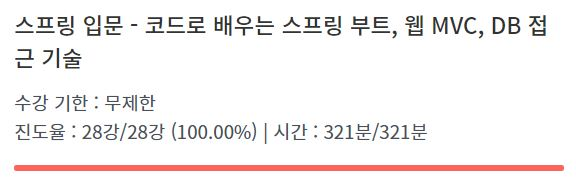

# 인프런 - 스프링 입문 강의 내용 정리

### 🌳목차🚗

#### 1. 프로젝트 환경 설정

- [프로젝트 생성](01.CreateProject.md)
- [라이브러리 살펴보기](02.CheckLibraries.md)
- [View 환경 설정](03.ViewSettings.md)
- [빌드하고 실행하기](04.BuildAndRun.md)

 

 

#### 2. 스프링 웹 개발 기초

- [정적 컨텐츠](05.StaticContents.md)
- [MVC와 템플릿 엔진](06.MVCandTemplateEngine.md)
- [API](07.API.md)

 

 

#### 3. 회원 관리 예제 - 백엔드 개발

- [비즈니스 요구사항 정리](08.BusinessRequirement.md)
- [회원 도메인과 리포지토리 만들기](09.CreateDomain&Repository.md)
- [회원 리포지토리 테스트 케이스 작성](10.RepositoryTest.md)
- [회원 서비스 개발](11.Service.md)
- [회원 서비스 테스트](12.ServiceTest.md)

 

 

#### 4. 스프링 빈과 의존 관계

- [컴포넌트 스캔과 자동 의존관계 설정](13.ComponentScan.md)
- [자바 코드로 직접 스프링 빈 등록하기](14.SpringBeanConfig.md)

 

 

#### 5. 회원 관리 예제 - 웹 MVC 개발

- [회원 웹 기능 - 홈 화면 추가](15.Home.md)
- [회원 웹 기능 - 등록](16.MemberRegister.md)
- [회원 웹 기능 - 조회](17.MemberList.md)

 

 

#### 6. 스프링 DB 접근 기술

- [H2 데이터베이스 설치](18.InstallH2.md)
- [순수 JDBC](19.JDBC.md)

- [스프링 통합 테스트](20.SpringTest.md)
- [스프링 JdbcTemplate](21.JdbcTemplate.md)
- [JPA](22.JPA.md)
- [스프링 데이터 JPA](23.SpringDataJPA.md)

 

 

#### 7. AOP

- [AOP가 필요한 상황](24.AOP.md)
- [AOP 적용](25.AOPApplication.md)

 

 

### 완강 !

실습 프로젝트는 [여기](https://github.com/o3o-ovo3/hello-spring)에 👈💕
